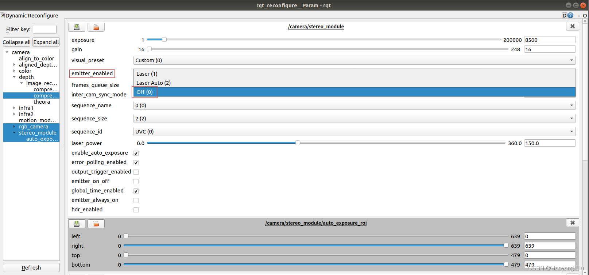

# 标定错误汇总

by——西米露

## D435i 的摄像头和imu联合标定

### 一、所需要的硬件和软件

#### **硬件**

摄像头：d435i （注意使用USB3.0的口）

imu：d435i 

标定板一个

#### **软件**

环境，Ubuntu18.04，ros-melodic

1. realsense-viewer（intel 的官方软件）

2. Intel Realsense SDK2.0 （Intel的工具箱）

   源码：https://github.com/IntelRealSense/librealsense.git

   依赖安装：

   ```bash
   sudo apt-get install libudev-dev pkg-config libgtk-3-dev
   sudo apt-get install libusb-1.0-0-dev pkg-config
   sudo apt-get install libglfw3-dev
   sudo apt-get install libssl-dev
   ```

   添加权限

   ```bash
   sudo cp config/99-realsense-libusb.rules /etc/udev/rulesgger
   sudo udevadm control --reload-rules && udevadm trigger
   ```

   编译、安装(在librealsense文件夹中)

   ```bash
   mkdir build
   cd build
   cmake …
   make
   sudo make install
   ```

   测试

   ```bash
   cd examples/capture
   ./rs-capture
   ```

3. realsense-ros

4. code_utils

   源码：https://github.com/gaowenliang/code_utils.git

5. imu_utils

   需要编译了code_utils先，可以先把imu_utils先移出工作空间。编译玩了再放回来进行编译。

   源码：https://github.com/gaowenliang/imu_utils.git

6. Kalibr

   参考官方的Installation步骤
   https://github.com/ethz-asl/kalibr/wiki/installation

在ros中使用需要安装ros组件

1. 创建工作空间、下载源码及编译

   ```bash
   mkdir -p realsense_ws/src
   cd realsense_ws/src
   git clone https://github.com/IntelRealSense/realsense-ros.git
   git clone https://github.com/pal-robotics/ddynamic_reconfigure.git
   catkin_make
   #编译完成，根据个人喜好，可永久添加source
   echo “source /realsense_ws/devel/setup.bash” >> ~/.bashrc
   source ~/.bashrc
   
   ```

   

2. 测试

   - source devel/setup.bash

   - roslaunch realsense2_camera rs_camera.launch

   - rostopic list

     查看发布了一堆realsense的话题没有。

   后续需要使用d435i进行vins_fusion实战，因此该配置为双目+imu，修改rs_camera.launch。

   找到你安装的realsense-ros包，复制launch文件中的rs_camera.launch文件，并重命名为rs_camera2.launch（命名自定），修改如下的参数：

   修改前：

   ```cpp
   <arg name="unite_imu_method"          default=""/>
   ```

   修改后

   ```cpp
   <arg name="unite_imu_method"          default="linear_interpolation"/>
   ```

   具体还有其他参数，自行修改查看。

### 二、标定前的硬件检查

#### 1.imu检查

在标定前我们需要查看相机的加速度在静止时是否正常，标准是加速度计的N：9.8左右。
通过打开realsense-viewer，点击Motion Module按键，然后放在Accel上观察。


如若数值不在9.8附近，则需要对imu进行校准。

#### 2.imu校准

若IMU加速度计正常，可跳过下面的校准过程。
realsense官方给了进行IMU校准的方法，参考网址为：https://dev.intelrealsense.com/docs/imu-calibration-tool-for-intel-realsense-depth-camera
下载对应的pdf文件，直接从第三节开始看即可。

##### 安装依赖

- sudo pip3 install pyrealsense2

**运行**

进入rs-imu-calibration文件夹

- cd librealsense/tools/rs-imu-calibration
- python rs-imu-calibration.py

根据提示旋转六面。具体参照https://github.com/IntelRealSense/librealsense/blob/master/tools/rs-imu-calibration/README.md

注：1.为保证六面水平，可用realsense包装盒制作六面校准工装，2.采集每一面数据时，保证无振动干扰。（就是程序显示开始校准后，尽量静止不动直到提示完成这一面后再进行下一个面的校准）

###### 保存、写入校准数据

六面数据采集完成后，提示：
Would you like to save the raw data?
输入yes，完成并写入硬件中。校准的数据保存在同目录下calibration.json中。

### 三、标定

#### 1.imu标定

1.找到你安装的realsense-ros包，复制launch文件中的rs_camera.launch文件，并重命名为rs_camera2.launch（命名自定），修改如下的参数：
修改前：

```bash
<arg name="unite_imu_method"          default=""/>
```


修改后

```bash
<arg name="unite_imu_method"          default="linear_interpolation"/>
```

修改该参数的目的是为了将加速度计（accel）和陀螺仪（gyro）的数据合并得到imu话题。

运行相机启动文件

```bash
roslaunch realsense2_camera rs_camera2.launch
```

2.打开~/catkin_ws/src/imu_utils/launch（参考自己的安装路径），在此位置打开终端并运行命令

```bash
gedit d435i_imu_calibration.launch
```

写入如下内容：

    <launch>
        <node pkg="imu_utils" type="imu_an" name="imu_an" output="screen">
            <!--TOPIC名称和上面一致-->
            <param name="imu_topic" type="string" value= "/camera/imu"/>
            <!--imu_name 无所谓-->
            <param name="imu_name" type="string" value= "d435i"/>
            <!--标定结果存放路径-->
            <param name="data_save_path" type="string" value= "$(find imu_utils)/data/"/>
            <!--数据录制时间-min-->
            <param name="max_time_min" type="int" value= "50"/>
            <!--采样频率，即是IMU频率，采样频率可以使用rostopic hz /camera/imu查看，设置为200，为后面的rosbag play播放频率-->
            <param name="max_cluster" type="int" value= "200"/>
        </node>
    </launch>


在imu_utils下创建data文件夹，标定结果将存放到此处。
3.录制数据包，将realsense相机静止放置，放置时间要略大于d435i_imu_calibration.launch中设置的录制时间，即大于50min（参考别的博客有设置120min的，也有50min的，经过自己测试50min是可以的）

```bash
rosbag record -O imu_calibration /camera/imu
```

其中imu_calibration是录制bag包的名字，可自己定义，录制的包会生成在当前终端的目录下，/camera/imu是相机发布的IMU话题。

4.运行标定程序

```bash
cd /catkin_ws
source ./devel/setup.bash
roslaunch imu_utils d435i_imu_calibration.launch
```

5.打开新终端，播放录制的数据包
rosbag play -r 200 imu_calibration.bag
标定结束后，我们打开/catkin_ws/src/imu_utils/data，其中d435i_imu_param.yaml是我们需要的结果，内容如下：

```bash
%YAML:1.0
---
type: IMU
name: d435i
Gyr:
   unit: " rad/s"
   avg-axis:
      gyr_n: 1.9243758665672117e-03
      gyr_w: 2.7254175454049154e-05
   x-axis:
      gyr_n: 1.7617583709168296e-03
      gyr_w: 3.4288470593085246e-05
   y-axis:
      gyr_n: 2.5899357735630793e-03
      gyr_w: 3.5865484306354172e-05
   z-axis:
      gyr_n: 1.4214334552217264e-03
      gyr_w: 1.1608571462708043e-05
Acc:
   unit: " m/s^2"
   avg-axis:
      acc_n: 1.6855999652754222e-02
      acc_w: 7.0793241968111124e-04
   x-axis:
      acc_n: 1.1503084845270073e-02
      acc_w: 5.7285080233574772e-04
   y-axis:
      acc_n: 1.7596343469737430e-02
      acc_w: 8.4920699202932677e-04
   z-axis:
      acc_n: 2.1468570643255160e-02
      acc_w: 7.0173946467825925e-04
```

#### 2.相机标定

1. 生成标定板或者使用现有标定板

   使用指令生成标定板，生成标定板的方法，参考https://github.com/ethz-asl/kalibr/wiki/calibration-targets

   在kalibr文件路径下运行指令：

   ```bash
   source ./devel/setup.bash
   kalibr_create_target_pdf --type apriltag --nx 6 --ny 6 --tsize 0.055 --tspace 0.3
   ```

   即可在该路径下生成标定板pdf文件，打印时缩放40%。

   打印出来后的格子参数为：
   大格子边长：2.2cm
   小格子边长：0.66cm
   小个子与大格子边长比例：0.3
   新建april_6x6_A4.yaml文件，内容如下：

   ```
   target_type: 'aprilgrid' #gridtype
   tagCols: 6               #number of apriltags
   tagRows: 6               #number of apriltags
   tagSize: 0.022           #size of apriltag, edge to edge [m]
   tagSpacing: 0.3          #ratio of space between tags to tagSize
   ```

   -------

   实验室的标定板略有不准，建议自行测量。

   棋盘格的数据

   ```bash
   target_type: 'checkerboard' #gridtype
   targetCols: 5               #number of internal chessboard corners
   targetRows: 8               #number of internal chessboard corners
   rowSpacingMeters: 0.045      #size of one chessboard square [m]
   colSpacingMeters: 0.045      #size of one chessboard square [m]
   ```

   棋盘格注意数的的内角不是外角，实测实验室4.5cm。

   建议用棋盘格一边进行标定，效果比另一边会好很多。

2. 关闭相机结构光

   - 先启动相机节点

     ```bash
      roslaunch realsense2_camera rs_camera.launch
     ```

     

   - 接着打开rqt节点

     ```
     rosrun rqt_reconfigure rqt_reconfigure
     ```

     打开后将camera->stereo_module中的emitter_enabled设置为off(0) ，如下图所示：

     

     --------

     还有一种利用realsense-viwer实现关闭。

     realsense-viewer

     

3. #### 将相机对准标定板进行标定

   打开 rviz

   添加rgb相机和双目对应的话题，/camera/color/image_raw、/camera/infra1/image_rect_raw、/camera/infra2/image_rect_raw
   效果如下：

   

录制视频：

开始移动相机，同时确保标定板一直在三个图像中（一般color没过就好）

注意板子反光会影响到标定，过明过暗都会影响到标定的结果，尽量让标定板在屏幕各个方位都出现。

**步骤如下：**
（1）俯仰角摆动3次
（2）偏航角摆动3次
（3）翻滚角摆动3次
（4）上下移动3次
（5）左右移动3次
（6）前后移动3次
（7）自由移动，摆动幅度大一些，但要移动缓慢些，使得标定目标尽可能出现在相机的所有视野范围内
整体标定时间在90s以上

参考视频：

https://www.bilibili.com/video/av335270111/?vd_source=102d9174465367a6ee8d97992826427d

https://www.youtube.com/watch?app=desktop&v=puNXsnrYWTY

4.修改相机帧数

官方推荐4Hz，通过如下命令更改topic发布频率

```bash
rosrun topic_tools throttle messages /camera/color/image_raw 4.0 /color
rosrun topic_tools throttle messages /camera/infra1/image_rect_raw 4.0 /infra_left
rosrun topic_tools throttle messages /camera/infra2/image_rect_raw 4.0 /infra_right

```

5.录制ROS bag

```bash
rosbag record -O multicameras_calibration_biaoding /infra_left /infra_right /color

```

/infra_left 、/infra_right、 /color为频率转换后的topic

6.使用Kalibr进行标定

```bash
cd kalibr_workspace/
source ./devel/setup.bash
kalibr_calibrate_cameras --target ~/kalibr_workspace/april_6x6_A4.yaml --bag ~/multicameras_calibration_biaoding.bag --models pinhole-radtan pinhole-radtan pinhole-radtan --topics /infra_left /infra_right /color --bag-from-to 10 145 --show-extraction --approx-sync 0.04
```

其中–target ~/kalibr_workspace/april_6x6_A4.yaml是标定板的配置文件
–bag ~/multicameras_calibration_biaoding.bag是录制的ROS bag数据包
–models pinhole-radtan pinhole-radtan pinhole-radtan表示三个摄像头的相机模型和畸变模型（VINS使用的畸变模型为radtan）
–topics /infra_left /infra_right /color表示双目相机和rgb相机的话题
–bag-from-to 10 145表示处理bag中10s-145s的数据（根据自己录制的数据包时间设置，rosbag info 你自己的数据包 即可查看数据包信息）
–show-extraction表示显示检测特征点的过程

----

标定过程可以看看有没有正确识别到标定板。

得到三个文件，分别是yaml，pdf,txt格式的结果。

打开pdf查看

重投影误差reprojection error数值是多少，理想范围是0.1-0.2

#### 3.imu和双目相机的联合标定

1.编写chain_biaoding.yaml文件

格式参考Kalibr官方https://github.com/ethz-asl/kalibr/wiki/yaml-formats

中的chain.yaml
文件中的参数需要根据之前相机标定的参数进行修改，示例如下：

chain_biaoding.yaml

```yaml
cam0:
  camera_model: pinhole
  distortion_coeffs: [0.002403959808138445, 0.001212094600722141, 0.0027975318922339606,
    0.0013305451339391025]
  distortion_model: radtan
  intrinsics: [389.1883630968763, 389.9466918297371, 322.6505040434058, 244.3879141231001]
  resolution: [640, 480]
  rostopic: /infra_left
cam1:
  T_cn_cnm1:
  - [0.9999926028685168, -0.001487673332607009, -0.0035469756557070867, -0.04984719672282643]
  - [0.0014555068111333671, 0.9999579513465346, -0.00905411722710673, -0.0008787616669883903]
  - [0.0035602960789059574, 0.009048887605385341, 0.9999527198447602, -0.001377119612210997]
  - [0.0, 0.0, 0.0, 1.0]
  camera_model: pinhole
  distortion_coeffs: [0.0030741870441258153, -0.0007281728041349596, 0.005821862258640268,
    0.002985916170301623]
  distortion_model: radtan
  intrinsics: [388.3951195864708, 388.5489092325429, 324.7077416689968, 248.62827656157992]
  resolution: [640, 480]
  rostopic: /infra_right
```

T_cn_cnm1表示的是左目相机到右目相机的旋转和平移，参考之前相机标定的结果。

2.编写imu_biaoding.yaml
格式参考[https://github.com/ethz-asl/kalibr/wiki/yaml-formats
](https://github.com/ethz-asl/kalibr/wiki/yaml-formats)中的imu.yaml，文件中的参数参考之前imu标定得到的参数，示例如下：

imu_biaoding.yaml

```yaml
#Accelerometers
accelerometer_noise_density: 1.6855999652754222e-02  #Noise density (continuous-time)
accelerometer_random_walk:   7.0793241968111124e-04  #Bias random walk

#Gyroscopes
gyroscope_noise_density:     1.9243758665672117e-03   #Noise density (continuous-time)
gyroscope_random_walk:       2.7254175454049154e-05  #Bias random walk

rostopic:                    /imu      #the IMU ROS topic
update_rate:          200.0      #Hz (for discretization of the values above)

```

3.准备好之前的april_6x6_A4.yaml

april_6x6_A4.yaml

```yaml
target_type: 'aprilgrid' #gridtype
tagCols: 6               #number of apriltags
tagRows: 6               #number of apriltags
tagSize: 0.022           #size of apriltag, edge to edge [m]
tagSpacing: 0.3          #ratio of space between tags to tagSize
# codeOffset: 0            #code offset for the first tag in the aprilboard

```

棋盘格的数据

```bash
target_type: 'checkerboard' #gridtype
targetCols: 5               #number of internal chessboard corners
targetRows: 8               #number of internal chessboard corners
rowSpacingMeters: 0.045      #size of one chessboard square [m]
colSpacingMeters: 0.045      #size of one chessboard square [m]
```

4.修改之前rs_camera2.launch中的文件，内容如下：

（1）imu和双目数据时间对齐

```yaml
<arg name="enable_sync"               default="true"/>
```


（2）合并加速度计和陀螺仪的topic（之前设置过了，再检查一下）

```yaml
<arg name="unite_imu_method"          default="linear_interpolation"/>

```

5.启动realsense相机

```bash
roslaunch realsense2_camera rs_camera2.launch
```


6.关闭结构光
参考2.3

7.打开rviz
添加imu、infra1和infra2的话题，同时调整相机位置，保证双目图像一直包含标定板的全部内容

8.调整imu和双目的话题发布频率并以新的话题发布

```bash
rosrun topic_tools throttle messages /camera/infra1/image_rect_raw 20.0 /infra_left
rosrun topic_tools throttle messages /camera/infra2/image_rect_raw 20.0 /infra_right
rosrun topic_tools throttle messages /camera/imu 200.0 /imu
```


9.录制ROS bag数据包
录制过程和之前相机的相同，只是录制命令不同：

```bash
rosbag record -O imu_stereo_biaoding.bag /infra_left /infra_right /imu
```

10.录制完毕后开始标定
将准备的文件放在kalibr_workspace文件夹下，包括chain_biaoding.yaml、imu_biaoding.yaml、april_6x6_A4.yaml和imu_stereo_biaoding.bag
标定命令如下：

```bash
kalibr_calibrate_imu_camera --bag imu_stereo_biaoding.bag --cam chain_biaoding.yaml --imu imu_biaoding.yaml --target april_6x6_A4.yaml --bag-from-to 10 140 --show-extraction

```

(记得改包名和相对应的配置文件的路径。)

最终的到结果如下：

标定结果好坏查看results-imucam-imu_stereo_biaoding.txt中的重投影误差Reprojection error，两个相机的数值都在0.15以下说明标定结果良好


#### 4.imu与激光雷达联合标定

hku联合标定算法：https://github.com/hku-mars/LiDAR_IMU_Init

安装ros包，按着readme操作即可。成功在launch中启动好相关雷达和imu相关标题，然后运行之后，按照官方演示在三个方向上晃动雷达imu，三个条填满后会进入重标定，等重标定完成之后在result中看到结果。（检查结果正确度，晃动不够大或者太快可能导致结果不够准确）

遇到的一个问题是使用16线robosense雷达时出现Failed to find match for field 'intensity'错误，解决方法是用rs_to_vedlodyne转化成velodyne格式进行输出。

https://blog.csdn.net/weixin_40599145/article/details/127646606（解决rs_to_velodyne出现错误的方法，理论上标定程序也是这个错误，但复杂所以选择更简单的方法）

## 参考来源

- Realsense d435i驱动安装、配置及校准    https://blog.csdn.net/u010196944/article/details/127238908
- D435i相机的标定及VINS-Fusion config文件修改    https://blog.csdn.net/m0_46555669/article/details/127277626